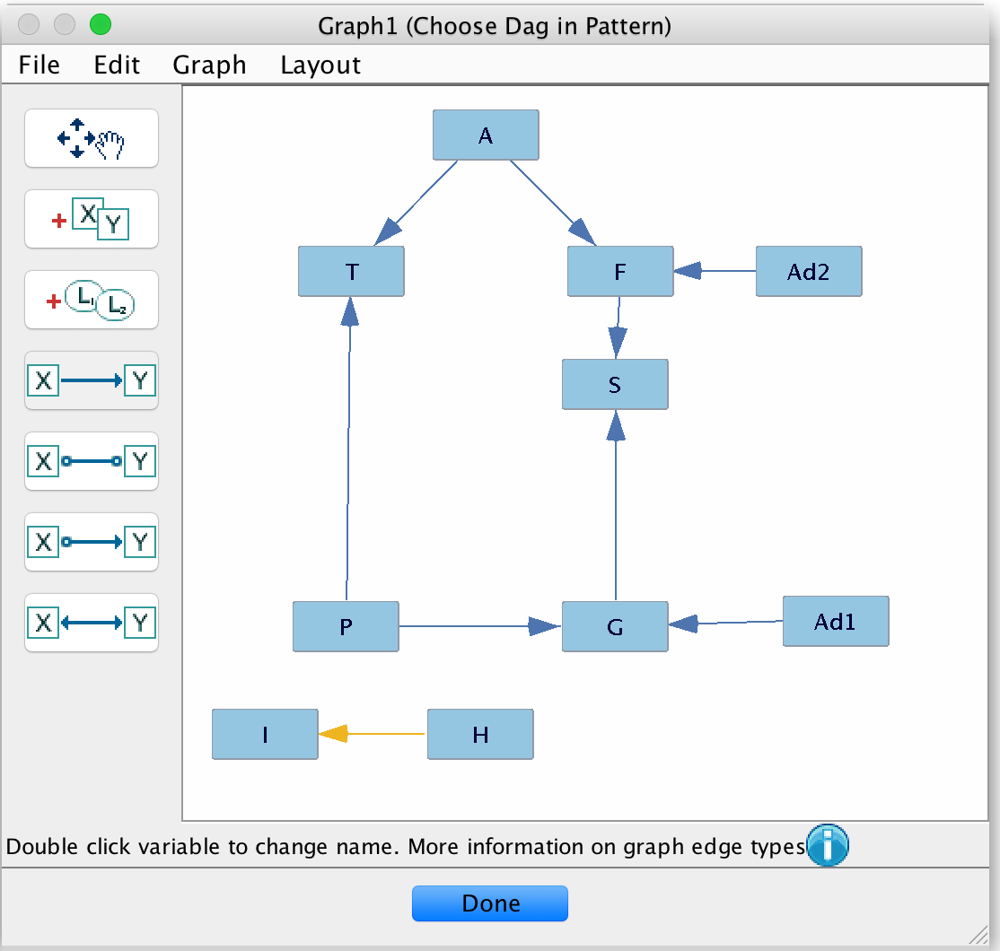

# Artificial Intelligence
## HW3: Having a Bayes Ball

### 1.

***

### 2.
The PC Learning algorithm scans a data set for conditional independences between all pairs of variables. Next, it uses the learned relationships to create an undirected graph. Then, edges are directed given information from conditional independences. Edges are left undirected if no conditional independences were found.
***

### 3.
Using the data, the algorithm was able to find dependence relationships between most variables. The algorithm found that both *I* and *H* were conditionally independent from the rest of the variables. Additionally, the algorithm added an undirected edge between *I* and *H* because no conditional independences were found. *I* and *H* are disjoint from the rest of the graph because the algorithm found they were independent of all the other variables.
***

### 4.
```In a small paragraph, argue for whether or not you believe this practice should be considered ethical, especially if each individual's characteristics were collected via social media. Compare this practice to targeted political advertising wherein ads are curated based on perceived in-group.```
***
